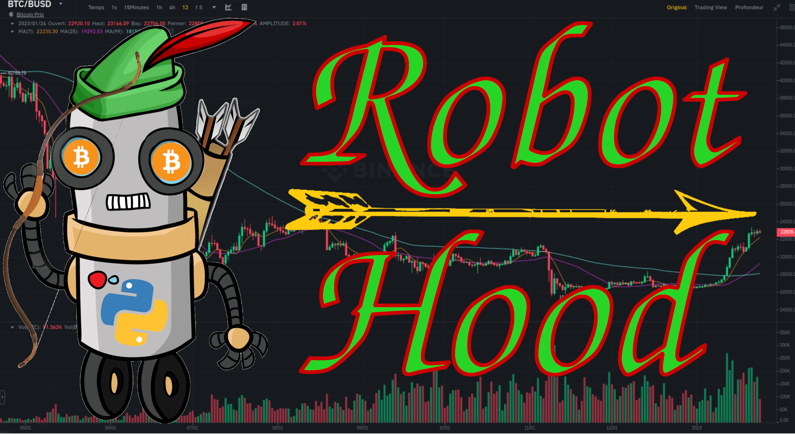

<p align="center">
    
</p>
<p align="center">
    
    
    
    
    
</p>

# Dummy RobotHood

RobotHood is a generous crypto trading bot giving its profits to non-governmental organisations.

<b> /!\ WARNING: THIS IS THE DUMMY VERSION OF ROBOTHOOD IT DOES NOT TRADE ANYTHING.</b>

## Installation

To make the bot run, you will need to set three environment variables:
- ROBOTHOOD_PATH: the path to your `robothood` folder.
- DISCORD_TOKEN: your discord connection token.
- BAPI_KEY: your binance public API key.
- BAPI_SECRET: your binance secret API key.

You can install robothood localy by running in the robothood repository:

`pip install .`

## Quickstart

First build the docker image:

```docker build -t robothood .```

If you are in the robothood folder else, change `.` by the correct location.

To make it run:

`sudo ./run.sh`

In order to manage orders left open you can run leftover option of `run.sh` as follows:

`./run.sh --leftovers` or `./run.sh -l`

For now this option is triggered with a crontab.

## Project status

WIP

### Current features
- Read crypto trading messages from Discord.
- Buy if the market conditions are aligned with the incoming message.
- Directly place an OCO order with the conditions told by the trading message.
- Store missed orders in a DB to treat them later.
- Manage these leftovers orders: buy or close them.

## Bonus

You can check the UML diagram of RobotHood [here](/robothood_uml.drawio),
open it with draw.io

## Contact Me
Email: maxime.caitucoli@live.fr

LinkedIn: https://www.linkedin.com/in/maxime-caitucoli/
